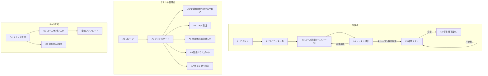

# Phase 1 (MVP) 実装着手仕様 — 画面遷移 & API

> 別リポジトリでの実装着手資料。DESIGN.md のアーキテクチャを前提に、**画面遷移・API・状態遷移・中核アルゴリズム**を1段深掘り。
> スタック: Next.js(App Router)+TypeScript+Tailwind / PostgreSQL(RLS) / Cloudflare Stream(or Mux)
> 最終更新: 2026-07-15

---

## 1. ロールと責務

| ロール | 主な操作 | 画面群 |
|-------|---------|-------|
| **operator**（SaaS運営） | テナント作成・コース/教材マスタ・請求 | O 系 |
| **admin**（テナント管理者=人事） | 受講者招待・コース割当・進捗確認・監査エクスポート | A 系 |
| **learner**（受講者=従業員） | 動画視聴・確認テスト・修了証取得 | L 系 |

---

## 2. 画面遷移図



---

## 3. 画面別 要素定義（抜粋）

### 受講者
| ID | 画面 | 主要素 | 主API |
|----|------|-------|-------|
| L2 | マイコース一覧 | 受講中/修了タブ・進捗バー | `GET /me/enrollments` |
| L3 | コース詳細 | レッスン一覧・各カバレッジ・次に見る | `GET /enrollments/{id}` |
| L4 | レッスン視聴 | HLSプレイヤー・シークバー・**在席確認**・進捗% | `GET /lessons/{id}/playback`, `POST /enrollments/{id}/events` |
| L5 | 確認テスト | 設問・提出・結果 | `GET /courses/{id}/quiz`, `POST /enrollments/{id}/quiz-attempts` |
| L6 | 修了 | 修了証プレビュー・PDF DL | `POST /enrollments/{id}/certificate`, `GET .../certificate` |

### テナント管理者
| ID | 画面 | 主要素 | 主API |
|----|------|-------|-------|
| A2 | ダッシュボード | 受講者数・修了率・平均カバレッジ・総受講時間 | `GET /tenant/summary` |
| A3 | 受講者管理 | 一覧・招待・**CSV一括取込**（社員番号） | `GET/POST /tenant/users`, `POST /tenant/users/import` |
| A4 | コース割当 | 受講者×コースの割当 | `POST /enrollments` |
| A5 | 受講者詳細 | 視聴ログ明細・区間カバレッジ・テスト結果 | `GET /enrollments/{id}/detail` |
| A6 | 監査エクスポート | 期間/対象指定→非同期生成→DL | `POST /exports`, `GET /exports/{id}` |

### 運営
| ID | 画面 | 主要素 | 主API |
|----|------|-------|-------|
| O1 | テナント管理 | 作成・しきい値設定(subsidy_settings) | `POST/PATCH /tenants` |
| O2 | コース/教材マスタ | コース作成・動画アップロード(署名URL) | `POST /courses`, `POST /videos/upload-url` |

---

## 4. API 仕様（REST / JSON）

共通:
- 認証: セッションCookie（httpOnly, SameSite=Lax）。全 API は認証必須（L1/A1 除く）。
- テナント境界: サーバがセッションの `tenant_id` を強制付与。**クライアントからの tenant 指定は無視**。
- エラー: `{ "error": { "code": "...", "message": "..." } }` / 4xx・5xx。
- レート制限: 認証・イベント投入・エクスポートに個別上限。

### 4.1 認証
```
POST /api/auth/login      { email, password } → 200 { user: {id, role, tenant_id, name} }
POST /api/auth/logout     → 204
GET  /api/auth/session    → 200 { user } | 401
```

### 4.2 テナント / ユーザー
```
POST  /api/tenants                 (operator) { name, subsidy_settings } → 201 { tenant }
PATCH /api/tenants/{id}            (operator) { subsidy_settings } → 200
GET   /api/tenant/users            (admin)    → 200 { users:[...] }
POST  /api/tenant/users            (admin)    { email, name, employee_no } → 201 (招待メール送信)
POST  /api/tenant/users/import     (admin)    multipart CSV(email,name,employee_no) → 202 { imported, errors:[] }
```

### 4.3 コース / 教材 / 動画
```
POST /api/courses                  (operator) { title, category, required_watch_ratio, pass_score } → 201
POST /api/courses/{id}/lessons     (operator) { title, order, video_asset_id, duration_sec } → 201
POST /api/videos/upload-url        (operator) { filename } → 201 { upload_url, video_asset_id }  ← Stream/Mux 署名アップロード
GET  /api/lessons/{id}/playback    (learner)  → 200 { hls_url(署名/短命), duration_sec }
```

### 4.4 受講登録
```
POST /api/enrollments              (admin) { user_id, course_id, valid_from, valid_to } → 201 { enrollment }
GET  /api/me/enrollments           (learner) → 200 { enrollments:[{id,course,status,progress_ratio}] }
GET  /api/enrollments/{id}         (learner/admin) → 200 { course, lessons:[{id,title,covered_ratio,is_completed}] }
```

### 4.5 ★ 視聴イベント投入（中核）
```
POST /api/enrollments/{id}/events
Body: {
  session_id: "uuid",           // 視聴セッション（連続再生の単位）
  lesson_id: "...",
  events: [                     // 数秒分をまとめてバッチ送信（送信失敗に強い）
    { type:"play"|"pause"|"seek"|"timeupdate"|"heartbeat"|"ended",
      position_sec: number,
      playback_rate: number,
      client_ts: "ISO8601" }
  ]
}
→ 202 { accepted: n }
```
サーバ処理:
1. `tenant_id`・`enrollment` の所有者一致を検証（越境拒否）。
2. **server_ts をサーバ側で付与**（client_ts は参考値）。
3. `WatchEvent` に **append-only** で保存、`hash = H(prev_hash + payload)` を連結。
4. 非同期 or 都度で `WatchSegment`／`LessonProgress` を更新（§6）。
5. `playback_rate > 2.0` の区間は実視聴に計上しない。

送信ポリシー（クライアント）: heartbeat 7秒間隔 + イベント都度。オフライン時はローカルバッファし復帰時に再送。`visibilitychange`（非アクティブ）で in-active フラグ。

### 4.6 進捗 / 確認テスト / 修了証
```
GET  /api/enrollments/{id}/progress   → 200 { lessons:[{lesson_id,covered_ratio,watched_sec,is_completed}], course_ratio }
GET  /api/courses/{id}/quiz           (learner) → 200 { questions:[{id,text,choices}] }  // 正答は返さない
POST /api/enrollments/{id}/quiz-attempts { answers:[{question_id, choice_id}] } → 200 { score, passed }
POST /api/enrollments/{id}/certificate → 201 { certificate }   // 修了条件未達なら 409
GET  /api/enrollments/{id}/certificate → 200 (PDF)
```

### 4.7 監査エクスポート（非同期）
```
POST /api/exports  (admin) { type:"records"|"detail"|"summary", scope:{ course_id?, user_ids?, from, to }, format:"csv"|"pdf" }
  → 202 { export_id, status:"processing" }
GET  /api/exports/{id}  → 200 { status:"done", file_url, hash } | { status:"processing" }
```

---

## 5. 状態遷移

### Enrollment.status
```
active ──(全レッスン is_completed かつ quiz passed)──▶ completed ──▶ [Certificate 発行可]
active ──(valid_to 経過)──▶ expired
```

### Lesson 完了条件
```
is_completed = (covered_ratio ≥ course.required_watch_ratio)   // 既定 0.95
             AND （そのレッスンに確認テストがある場合）quiz.passed
```

### Course 完了条件
```
全 Lesson.is_completed = true  AND  course 確認テスト passed（コース単位テストがある場合）
→ Enrollment.status = completed, completed_at 記録
```

---

## 6. ★ 修了判定エンジン（擬似コード）

```pseudo
function recomputeLessonProgress(enrollment_id, lesson_id):
    events = WatchEvent.where(enrollment_id, lesson_id).order_by(server_ts)
    segments = []
    open = null
    for e in events:
        if e.playback_rate > 2.0: continue          # 超過速度は無効
        if e.type in [play, timeupdate, heartbeat]:
            if open == null: open = { start: e.position_sec, last: e.position_sec }
            elif e.position_sec - open.last <= HEARTBEAT_GAP(=10s) and e.position_sec >= open.last:
                open.last = e.position_sec           # 連続再生を延伸
            else:
                segments.push([open.start, open.last]); open = { start: e.position_sec, last: e.position_sec }
        if e.type in [pause, seek, ended]:
            if open: segments.push([open.start, open.last]); open = null

    merged = mergeOverlappingIntervals(segments)     # 複数回視聴の重複を排除
    covered_sec = sum(end - start for [start,end] in merged)
    duration    = Lesson(lesson_id).duration_sec
    covered_ratio = min(1.0, covered_sec / duration)

    LessonProgress.upsert(enrollment_id, lesson_id, {
        covered_ratio, watched_sec: covered_sec,
        is_completed: covered_ratio >= course.required_watch_ratio AND quizOk(lesson)
    })
    WatchSegment.replace(enrollment_id, lesson_id, merged)   # 監査用に区間を保存
    maybeCompleteEnrollment(enrollment_id)
```

ポイント:
- **ユニーク区間カバレッジ**：同一箇所の複数回視聴を二重計上しない／早送りスキップ区間は含めない。
- **サーバ時刻基準**でギャップ判定 → クライアント時計改ざんに非依存。
- 監査時は `WatchSegment`（見た区間）を提示できるので「どこを見たか」を面で証明。

---

## 7. データベース DDL（中核・抜粋）

```sql
-- テナント分離は RLS で強制
CREATE TABLE tenant (
  id uuid PRIMARY KEY DEFAULT gen_random_uuid(),
  name text NOT NULL,
  subsidy_settings jsonb NOT NULL DEFAULT '{}',   -- required_watch_ratio, min_hours, pass_score 等
  created_at timestamptz NOT NULL DEFAULT now()
);

CREATE TABLE app_user (
  id uuid PRIMARY KEY DEFAULT gen_random_uuid(),
  tenant_id uuid NOT NULL REFERENCES tenant(id),
  role text NOT NULL CHECK (role IN ('operator','admin','learner')),
  email text NOT NULL, name text NOT NULL,
  employee_no text,                               -- 対象労働者の特定
  created_at timestamptz NOT NULL DEFAULT now(),
  UNIQUE (tenant_id, email)
);

CREATE TABLE enrollment (
  id uuid PRIMARY KEY DEFAULT gen_random_uuid(),
  tenant_id uuid NOT NULL REFERENCES tenant(id),
  user_id uuid NOT NULL REFERENCES app_user(id),
  course_id uuid NOT NULL,
  status text NOT NULL DEFAULT 'active' CHECK (status IN ('active','completed','expired')),
  valid_from date, valid_to date,
  enrolled_at timestamptz NOT NULL DEFAULT now(),
  completed_at timestamptz
);

-- 追記専用・改ざん検知
CREATE TABLE watch_event (
  id bigserial PRIMARY KEY,
  tenant_id uuid NOT NULL,
  enrollment_id uuid NOT NULL REFERENCES enrollment(id),
  lesson_id uuid NOT NULL,
  session_id uuid NOT NULL,
  type text NOT NULL,
  position_sec double precision NOT NULL,
  playback_rate real NOT NULL DEFAULT 1.0,
  client_ts timestamptz,
  server_ts timestamptz NOT NULL DEFAULT now(),   -- 権威時刻
  prev_hash text, hash text NOT NULL
);
-- UPDATE/DELETE をロール権限で禁止（append-only）

CREATE TABLE lesson_progress (
  enrollment_id uuid NOT NULL, lesson_id uuid NOT NULL,
  covered_ratio real NOT NULL DEFAULT 0,
  watched_sec integer NOT NULL DEFAULT 0,
  is_completed boolean NOT NULL DEFAULT false,
  first_watched_at timestamptz, last_watched_at timestamptz,
  PRIMARY KEY (enrollment_id, lesson_id)
);

-- RLS 例（越境参照をDBレベルで遮断）
ALTER TABLE enrollment ENABLE ROW LEVEL SECURITY;
CREATE POLICY tenant_isolation ON enrollment
  USING (tenant_id = current_setting('app.tenant_id')::uuid);
```

---

## 8. 非機能・受け入れ基準（Definition of Done）

- [ ] 早送り／末尾シークで完了扱いにならない（E2E: seek だけで covered_ratio が上がらない）
- [ ] 同一区間の複数回視聴が二重計上されない（E2E: 同じ1分×3回 = covered_sec 60s）
- [ ] タブ非アクティブ／離席区間が実視聴に加算されない
- [ ] テナント越境参照が RLS で遮断される（別テナントの enrollment を取得できない）
- [ ] watch_event が UPDATE/DELETE 不可、hash チェーンが検証可能
- [ ] 監査エクスポート（受講記録/明細/サマリ）がハッシュ付きで出力できる
- [ ] 修了証 PDF に 受講者名・コース名・実受講時間・修了日・証明番号 が入る
- [ ] テストカバレッジ 80%以上（ユニット+結合+E2E）、視聴集計は境界値テスト必須

---

## 9. 実装スプリント案（別リポ着手用・目安）

| Sprint | 内容 | 主な DoD |
|--------|------|---------|
| S1 | 認証・RBAC・マルチテナント(RLS)・スキーマ | 越境遮断・ログイン |
| S2 | コース/教材/動画アップロード・受講登録 | 割当→受講者に表示 |
| S3 | **プレイヤー + イベント投入 + 集計エンジン** | カバレッジ正確・不正加算不可 |
| S4 | 確認テスト・修了判定・修了証PDF | 修了フロー一気通貫 |
| S5 | 監査エクスポート・管理ダッシュボード | 帳票ハッシュ付き出力 |
| S6 | 改ざん耐性(hash)・在席確認・QA/E2E・セキュリティスキャン | DoD 全項目クリア |

> 各スプリント末に QA Reviewer / Devil's Advocate レビュー（社内チェック&バランス）。
