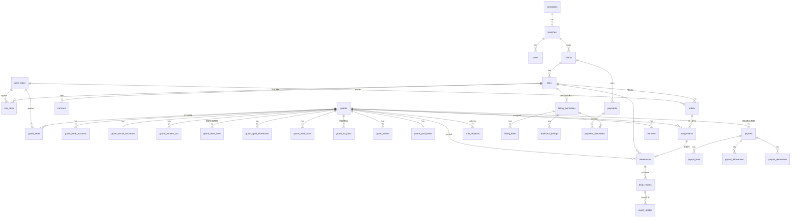

# 12. データモデル / ERD・スキーマ案

`01_domain-model.md` を実装可能なスキーマに具体化したもの。PostgreSQL 想定。
**決定事項を反映**:締めは**配置先(現場)単位**を基本(締め設定は `sites` が保持)。

> 凡例:PK=主キー、FK=外部キー、UQ=ユニーク。型は目安。すべてのテーブルに
> `id (uuid)`, `created_at`, `updated_at`, `created_by`, `updated_by` を持つ前提(以下では省略)。
> マルチテナント:`tenant_id (= company)` を全テーブルに付与し行レベルで分離(`11` E1)。

---

## ER 全体図(mermaid)



---

## 列挙型(Enum)

```
RATE_FORM        = 月極(monthly) | スポット(spot)
PAY_FORM         = 月給(monthly) | 日給月給(daily) | 週給(weekly)
PAY_METHOD       = 現金(cash) | 銀行振込(bank) | 郵便局(post)
ACCOUNT_TYPE     = 普通(ordinary) | 当座(checking)
TAX_METHOD       = 外税(exclusive) | 内税(inclusive)
ROUNDING         = 切捨(floor) | 四捨五入(round) | 切上(ceil)
REASSIGN_CLASS   = 可(ok) | 注意(caution) | 不可(ng) | 得意先不可(client_ng)
EMP_INS_CLASS    = 一般(general) | 日雇(daily) | 適用除外(exempt)
LEAVE_UNIT       = 対象外(none) | 日数(days) | 月単位(month) | 8割判定(ratio80)
GUARD_FLAG       = 社員(employee) | 外注(outsource) | 非警備員(non_guard)
SECURITY_TYPE    = 1号(facility) | 2号(traffic) | 3号(transport) | 4号(personal)
ASSIGN_STATUS    = 未配置(open) | 配置済(assigned) | 配置連絡済(notified)
                 | 出発報告済(departed) | 下番未確認(unconfirmed) | 実績(actual)
SUMMARY_STATUS   = 未集計(draft) | 集計済(aggregated) | 確定(closed)
REPORT_STATUS    = 下書き(draft) | 提出済(submitted) | 承認済(approved) | 差戻し(rejected)
RATE_ITEM        = 単価(base) | 残業(overtime) | 昼残(day_ot) | 早出(early)
                 | 遅刻(late) | 時給(hourly) | 深夜(night) | 深夜残業(night_ot)
                 | 時間外(extra) ...
USER_ROLE        = owner | admin | dispatcher | accounting | branch_manager
                 | site_leader | guard
```

---

## 組織・権限

### companies(自社)
| 列 | 型 | 備考 |
|----|----|------|
| name | text | 会社名 |
| invoice_reg_no | text | インボイス登録番号 T+13桁 |
| address, tel, fax | text | |
| bank_accounts | jsonb | 振込先口座(複数) |
| invoice_header | jsonb | 請求書ヘッダ設定 |

### branches(支店)
| 列 | 型 |
|----|----|
| company_id | FK |
| code | text UQ(例 01) |
| name | text |

### users(担当者/ログインユーザー)
| 列 | 型 | 備考 |
|----|----|------|
| branch_id | FK | 所属支店 |
| guard_id | FK nullable | 隊員アカウントの場合に紐付け |
| name, email | text | |
| role | USER_ROLE | |
| permissions | jsonb | 画面/機能/データ範囲の上書き(`09`) |
| status | active/disabled | 退職で即無効化 |

---

## 取引先・現場

### clients(得意先)
| 列 | 型 | 備考 |
|----|----|------|
| branch_id | FK | |
| code | text UQ(6桁) | |
| name, kana | text | |
| billing_address, tel, fax | text | |
| invoice_note | text | 請求書備考 |

### sites(配置先/現場)★締め設定の保持先
| 列 | 型 | 備考 |
|----|----|------|
| client_id | FK | 親得意先 |
| branch_id | FK | |
| code | text(4桁) | 得意先配下で採番 |
| name, kana, short_name | text | |
| site_address, billing_address | text | |
| subject, duty | text | 件名・担当業務 |
| security_type | SECURITY_TYPE | 警備業区分 |
| supervisor_name, site_tel | text | |
| report_email | text | 管制日報送付先 |
| sales_rep | text | |
| **closing_day** | int | 締日(例 20) |
| **billing_offset_months / billing_day** | int | 請求日(Nヶ月後X日) |
| **payment_offset_months / payment_day** | int | 入金予定日 |
| tax_method | TAX_METHOD | 外税/内税 |
| rounding | ROUNDING | 端数処理 |
| tax_rate | numeric | 税率 |
| radio_fee_per_unit / per_set | int | 無線機代 |
| rate_form | RATE_FORM | 月極/スポット |
| auto_hourly / pay_hourly_priority | bool | 計算オプション |
| rate_rank | text | 配置先単価ランク |
| has_kentaikyo | bool | 建退共加入 |
| contract_signed | bool | 警備契約書締結 |
| monthly_* | jsonb | 月極(契約人数/時間/単価) |

### site_rates(請求単価:現場×勤務種別×項目)
| 列 | 型 |
|----|----|
| site_id | FK |
| work_type_id | FK |
| item | RATE_ITEM |
| amount | int |
UQ(site_id, work_type_id, item)

### contracts(警備契約書)
| 列 | 型 | 備考 |
|----|----|------|
| site_id | FK | |
| type | 1号/2号 | |
| terms | jsonb | 20項目(期間/時間/場所/人員/料金/キャンセル料/賠償…) |
| signed_at | date | |

---

## 隊員

### guards(隊員)
| 列 | 型 | 備考 |
|----|----|------|
| branch_id | FK | |
| code | text(6桁) | |
| name, kana, gender | | |
| flags | GUARD_FLAG[] | 社員/外注/非警備員 |
| category_id | FK | 隊員区分 |
| address, tel, tel2, email, fax | | tel2=教育Pro携帯欄 |
| emergency_* | jsonb | 緊急連絡先(氏名/続柄/住所/電話) |
| joined_on, left_on, is_left | | |
| prior_exp_months, exp_months | int | 経験年数 |
| pay_form | PAY_FORM | |
| has_spouse, join_emp_ins, join_social_ins | bool | |
| income_tax_class | text | 月額(甲)等 |
| dependents | int | 扶養親族 |
| monthly_salary, late_unit_price | int | |
| perfect_attendance | jsonb | Nカウント以上でX円 |
| rate_rank | text | 隊員単価ランク |
| pay_method | PAY_METHOD | |
| use_daily_pay, hide_address_on_slip | bool | |
| notes, qual_text | text | |

### guard_rates(給与/スポット単価:隊員×勤務種別×項目+手当)
| 列 | 型 |
|----|----|
| guard_id, work_type_id | FK |
| item | RATE_ITEM |
| amount | int |
| allowance1_code, allowance1_amount, allowance2_code, allowance2_amount | | 手当 |

### guard_bank_accounts(振込)
bank_code, branch_code, account_type(ACCOUNT_TYPE), account_no, account_name, fee_by_guard(bool), slot(給与振込①…), symbol_no

### guard_social_insurance(社会保険)
| 列 | 備考 |
|----|------|
| std_remuneration | 4-6月平均報酬 |
| health_ins_amount, pension_amount, emp_ins_amount, care_ins_amount | 算出値 |
| health_ins_no, health_ins_name | 協会けんぽ/組合 |
| pension_name | 厚生年金等 |
| pension_receiver | 受給/非受給 |
| emp_ins_class | EMP_INS_CLASS |
| emp_ins_no, has_kentaikyo, voluntary_senior | |

> 介護保険は年齢40歳以上で計上(計算ロジック側、`05`§4-2)。

### guard_resident_tax(住民税)
guard_id, year, month(6..翌5), amount

### guard_fixed_lines(固定支給/控除)
guard_id, kind(payment/deduction), code, name, amount, skip_if_no_attendance(bool)

### guard_qual_allowances(資格手当)
guard_id, qual_code, amount, taxable(bool)

### guard_held_quals(保有資格)
guard_id, qualification_id, print_on_license_field(bool)

### guard_no_pairs(同配置NG)自己参照
guard_id, ng_guard_id, note  — 配置時にNG警告

### guard_claims(クレーム履歴)
guard_id, date, client_id, site_id, reassign_class(REASSIGN_CLASS), content

### guard_paid_leave(有給)
guard_id, grant_base_date, prev_grant_date, calc_start_date, show_on_slip(bool), unit(LEAVE_UNIT)

---

## 勤務・区分マスタ

- **work_types(勤務種別)**: code, name, base_start, base_end, is_night, is_holiday, requires_qual
- **work_groups**: 帳票集計グループ
- **security_categories**: code, name(SECURITY_TYPE)
- **qualifications**: code, name(交通誘導2級 等)
- **guard_categories(隊員区分)**: code, name(通常/1級 等)
- **holidays / weather**: マスタ

---

## トランザクション

### orders(受注枠) / order_details
- orders: branch_id, site_id, work_type_id, year_month
- order_details: order_id, date, required_count
> 「現場×勤務×日 の必要人数」(`02`①)

### assignments(配置)
| 列 | 型 | 備考 |
|----|----|------|
| date | date | |
| branch_id, site_id, work_type_id | FK | |
| guard_id | FK | 割当隊員 |
| status | ASSIGN_STATUS | 未配置→…→実績 |
| slot_no | int | 同一枠の何人目か |
| notified_at, departed_at, finished_at | timestamp | ステータス遷移時刻 |

### attendances(勤務実績)★中心テーブル
| 列 | 型 | 備考 |
|----|----|------|
| date | date | |
| branch_id, client_id, site_id, work_type_id, guard_id | FK | |
| assignment_id | FK nullable | 配置からの実績化 |
| base_start, base_end, report_start, report_end | time | 基本/報告(実働) |
| billing_pct, pay_pct | numeric | 請求%/給与% |
| break_min, night_break_min | int | 休憩/深休 |
| early, day_ot, overtime, late | numeric(h) | 早出/昼残/残業/遅早 |
| radio_units, radio_sets | int | |
| transport_fee, taxable_transport, fuel_fee, prev_diff, equipment_fee, heat_fee, drive_allowance, qual_allowance | int | 付帯費用 |
| distance, restriction_car | | |
| actual_h, billing_h, pay_h | numeric | 実H/請求H/給与H |
| is_daily_pay | bool | |
| **rate_overrides** | jsonb | 行単位の請求/給与単価上書き(NULL=マスタ参照, `05`§1) |
| billing_summary_id, payroll_id | FK nullable | 集計先(締め後に紐付け) |

> rate_overrides は「マスタ参照/上書き」を明示フラグで保持(0=参照の曖昧仕様をUIで解消, `07`§6)。

### daily_reports(日報)/ report_photos
- daily_reports: date, site_id, guard_id, attendance_id(FK), report_start, report_end, break_min, weather, notes, incident(bool), status(REPORT_STATUS), submitted_at, approved_by, gps_point(nullable)
- report_photos: daily_report_id, kind(日報/作業確認書/レシート), **drive_file_id, drive_url, thumbnail_url**, ocr_text(nullable), uploaded_at
> Drive保存(`08`)。原本は当面保管継続(B1決定)、DBは参照のみ保持。

### shift_requests(シフト希望)
guard_id, target_period, available_dates(jsonb), ng_dates(jsonb), preferred_sites(jsonb), max_consecutive, note, status

---

## 請求(現場単位で締め)

### billing_summaries(請求・締め単位=現場×期間)
| 列 | 型 | 備考 |
|----|----|------|
| client_id, site_id | FK | **現場単位**(A1決定) |
| period_start, period_end, closing_day | | 締め期間 |
| tax_rate, tax_method, rounding | | |
| subtotal, discount, additional_total, tax, non_taxable, total | int | 集計値 |
| status | SUMMARY_STATUS | 未集計/集計済/確定 |
| invoice_no, issued_at | | 請求書発行 |

### billing_lines(請求明細)
billing_summary_id, date, work_type_id, billing_form, headcount, unit_price, amount, overtime/night/etc, source_attendance_id(→実績へジャンプ)

### additional_billings(追加請求)
billing_summary_id, date, name, qty, unit_price, tax_rate, amount, taxable(bool)

> 得意先別請求書は billing_summaries を client_id で束ねて出力(`04` 御請求書サマリ)。

---

## 入金(売掛・消込)

### payments(入金)
client_id, scheduled_date, paid_date, amount, fee, safety_fee, adjustment, aggregate_ym

### payment_allocations(消込)
payment_id, billing_summary_id, allocated_amount
> 請求額=配賦合計で消込完了。差引で売掛残(`02` 入金管理)。

---

## 給与(締め期間)

### payrolls(給与)
guard_id, period_start, period_end, work_days, actual_h, pay_total, taxable_amount, deduction_total, **net_pay**, status(SUMMARY_STATUS), paid_on, confirmed(bool)

### payroll_lines(支払明細=実績由来)
payroll_id, date, site_id, work_type_id, pay_pct, unit_price, base_pay, total_pay, hourly_h, extra_unit, source_attendance_id

### payroll_allowances(手当) / payroll_deductions(控除)
payroll_id, code, name, amount(, taxable for allowances)
> 控除:所得税/健康保険/厚生年金/雇用保険/介護保険/住民税/固定控除(`02`⑨)。

### bonuses(賞与)
guard_id, period, payments(jsonb), deductions(jsonb), net

---

## 横断

### audit_logs(監査ログ)
actor_user_id, action, entity, entity_id, before, after, at
> 金額系(単価/給与/請求)操作と機微情報の閲覧を記録(`09`§3)。

### 集計の整合ルール
- 締め(billing_summaries/payrolls)は `status` で管理し、確定後の実績変更は**再集計**で更新(`05`§6)。
- attendances → billing/payroll は冪等な集計ジョブで生成(再実行で重複しない)。

---

## インデックス/制約の要点(抜粋)

- `attendances(date, site_id, guard_id, work_type_id)` に複合インデックス(配置/集計の主軸)。
- `assignments(date, site_id, work_type_id, guard_id)` UQ(同枠二重配置防止)。
- `payment_allocations` で請求への配賦合計 ≦ 入金額 をアプリ制約。
- すべて `tenant_id` でRLS(行レベルセキュリティ)。
