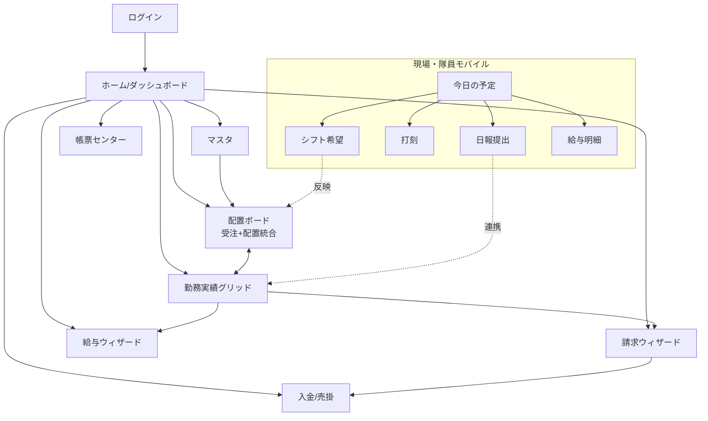

# 13. 主要画面ワイヤー & 画面遷移

`07`(圧縮方針)・`10`(UI/UX)を踏まえた主要画面のワイヤー(ASCII)と遷移図。
内勤(PC)と現場(スマホ)で分ける。ワイヤーは構造合意用で、確定デザインではない。

---

## 0. 画面遷移(全体ナビ)



ロールでナビ表示を絞る(`09`):隊員は Mobile 群のみ、経理は請求/入金/給与中心、配置担当は配置/実績中心。

---

## 1. ホーム/ダッシュボード(内勤)

「今やる残作業」を集約(`07`§10)。

```
┌──────────────────────────────────────────────────────────────┐
│ 警備Pro   支店:[01 本社 ▼]      🔍検索…        山田(配置担当)▼ │
├───────────┬──────────────────────────────────────────────────┤
│ ▣ ホーム  │  2026/06/01 (月)                                 │
│ ▤ 配置    │  ┌── 今日の状況 ─────────────────────────────┐  │
│ ▦ 実績    │  │ 受注 46  配置済 44  ⚠未配置 2   →[配置へ] │  │
│ ¥ 請求    │  │ 出勤予定 113  下番未確認 1                 │  │
│ ◉ 入金    │  └────────────────────────────────────────────┘  │
│ 💴 給与   │  ┌── 要対応 ───────────────────────────────────┐ │
│ ▥ マスタ  │  │ ・締め未集計の現場 3   →[請求へ]            │ │
│ 🖨 帳票   │  │ ・未消込の入金 5件     →[入金へ]            │ │
│ ⚙ 設定    │  │ ・未承認の日報 8件     →[日報承認へ]        │ │
│           │  │ ・未確定の給与 0       　                   │ │
│           │  └─────────────────────────────────────────────┘ │
└───────────┴──────────────────────────────────────────────────┘
```

---

## 2. 配置ボード(受注+配置 統合)★中核

`07`§2 で統合。左に必要人数(受注枠)、各行に割当状況。色+アイコン+文字でステータス(`10`§4)。

```
┌──────────────────────────────────────────────────────────────────────┐
│ 配置ボード   [◀ 6/1(月) ▶] [📅] 支店[01本社▼]  [月間人数入力] [印刷] │
├──────────────────────────────────────────────────────────────────────┤
│ 得意先 / 現場    勤務   要 配 状態        割当隊員                      │
│ モチベ/1交差点   日勤    6  5 ⚠未配置1   福沢, 日給月男, 野口, …  [＋] │
│ モチベ/1交差点   夜勤    2  2 ✓連絡済    中国, 馬場                    │
│ モチベ/B道路     日勤    2  2 ●出発済    深夜次郎, 深夜太郎             │
│ 第一生命/本社前  日勤    1  1 ✓配置済    夏目漱石                      │
│ …                                                                      │
├──────────────────────────────────────────────────────────────────────┤
│ 凡例:□未配置 ✓配置 ✓連絡 ●出発 ⚠下番未確認 ■実績                     │
└──────────────────────────────────────────────────────────────────────┘
   [＋]→ 隊員ピッカー(右パネル):資格/区分/休日(休·△)で絞込、配置済は赤字
   NG関係を入れると⚠ダイアログ「同配置NG:配置する/キャンセル/詳細」
```

隊員ピッカー(右ドロワー):
```
┌─ 隊員を選ぶ ──────────────┐
│ 🔍[フリガナ/番号]          │
│ 資格[交通2級▼] 区分[▼]     │
│ ☑空きのみ ☐休日交渉可(△)  │
│ ─────────────────────────│
│ 福沢諭吉   1級  空き    [選]│
│ 樋口一葉   1級  △交渉   [選]│
│ 夏目漱石   通常 ●本社前(赤)│
└────────────────────────────┘
```

---

## 3. 勤務実績グリッド(視点切替で5画面を統合)

`07`§1。Excelライク。列プリセットで横スクロール緩和(`10`§2)。

```
┌──────────────────────────────────────────────────────────────────────┐
│ 勤務実績  6/1(月)  視点[全体▼/現場/隊員/得意先]  列[基本入力▼]  [一括時間] │
├──────────────────────────────────────────────────────────────────────┤
│ # 得意先/現場      勤務  報告時間    請% 給% 残業 交通費 単価 [写真]      │
│ 1 モチベ/1交差点  日勤  09:00-18:00 1.0 1.0  -   600  18,000 📎2  ⋮     │
│ 2 モチベ/1交差点  日勤  09:00-20:00 1.0 1.0 2.0  -    18,000 📎1  ⋮     │
│ 3 第一生命/本社前 日勤  08:00-17:00 1.0 1.0  -   -    18,000 ―   ⋮     │
│ …                                                                      │
├──────────────────────────────────────────────────────────────────────┤
│ 単価セルに差分色=マスタ上書き  [マスタ参照/上書き]トグル                │
│ 📎=日報写真(Driveプレビュー)  行→ダブルクリックで日報/単価詳細           │
└──────────────────────────────────────────────────────────────────────┘
```

---

## 4. 請求ウィザード(集計→調整→発行を1画面)

`07`§4。3画面を縦フロー化。

```
┌─ 請求 ───────────────────────────────────────────────────────────┐
│ ① 締め対象     請求月[2026/05] 締日[20] 範囲[04/21–05/20] 支店[▼]  │
│    [検索] → モチベ/1交差点…  状態:未集計/集計済   [全件][締め集計] │
│ ─────────────────────────────────────────────────────────────────│
│ ② 明細調整(選択中:モチベ/1交差点)                                │
│    請求金額 2,208,000  追加請求[＋資機材 1,000][＋…]  値引[0]      │
│    消費税 235,900   合計 2,594,900                                 │
│    明細行→ダブルクリックで実績へ                                    │
│ ─────────────────────────────────────────────────────────────────│
│ ③ 発行  帳票[得意先別請求書▼] テンプレ[いつもの設定▼]              │
│    ☑消費税欄 ☐単価印刷 …    [プレビュー] [PDF] [印刷] [請求更新]   │
└────────────────────────────────────────────────────────────────────┘
```
> 得意先別請求書=現場(billing_summaries)を得意先で束ねたサマリ(`12`)。インボイス登録番号印字。

---

## 5. 入金 / 売掛(消込)

```
┌─ 入金・売掛 ─────────────────────────────────────────────────┐
│ 入金予定[ / – / ] [検索]                          未消込のみ ☑ │
│ 予定日     得意先          請求額    入金日    入金額   差引    │
│ 02/29     モチベ           286,770   ―         ―       286,770 │
│ 09/30     モチベ(青)       462,000   09/30      462,000  0      │
│ …                                                              │
│ 行クリック→ 請求(billing_summaries)へ配賦して消込             │
└────────────────────────────────────────────────────────────────┘
```

---

## 6. 給与ウィザード

```
┌─ 給与 ───────────────────────────────────────────────────────┐
│ ① 集計  形態[日給月給▼] 期間[04/21–05/20] 支店[▼]            │
│    オプション ☑固定支給 ☑固定控除 ☐全再計算 ☐社保 ☐住民税    │
│    [検索]→ 福沢諭吉(未)… [全件][給与集計]                     │
│ ─────────────────────────────────────────────────────────────│
│ ② 明細(福沢諭吉)                                            │
│    支給:基本給168,000 +手当(交通22,600/運転42,000/…) =249,840 │
│    控除:所得税/健保9,117/厚年16,470/雇用/住民12,000… =39,836  │
│    差引支払額 210,004    [所得税·社保再計算][明細再計算]       │
│ ─────────────────────────────────────────────────────────────│
│ ③ 確定·出力  [給与確定][明細PDF][振込データ(全銀)]            │
└────────────────────────────────────────────────────────────────┘
```

---

## 7. 帳票センター

```
┌─ 帳票 ───────────────────────────────────────────────┐
│ 区分[請求/法定/社内/経営]                              │
│ ・御請求書 / 配置先別明細 / 請求一覧                    │
│ ・作業員名簿(全建統一様式第5号) ★社保/建退共オプション │
│ ・1号·2号警備契約書(20項目差込)                       │
│ ・管制日報 / 賃金台帳 / 売上収支表                      │
│  各帳票:テンプレ選択 → [プレビュュー][PDF][Excel][保管] │
└────────────────────────────────────────────────────────┘
```
> 「指定様式での報告書出力＋法定書式で過去データを書面出力(データ保管も)」を集約(`04`)。出力物はDriveへ保管も可。

---

## 8. 現場・隊員モバイル(50歳以上配慮 `10`§3)

### 8-1. 今日の予定 / ホーム
```
┌────────────────────┐
│ 警備Pro   [文字 標/大/特大] │
│ おはようございます      │
│ 福沢さん               │
│ ┌────────────────┐   │
│ │ 今日の現場       │   │
│ │ 1交差点 道路工事 │   │
│ │ 09:00〜18:00     │   │
│ │ 📍地図  ☎現場    │   │
│ └────────────────┘   │
│ ┌──────┐ ┌──────┐   │
│ │ ⏱出勤 │ │ 📷日報 │   │ ← 大ボタン
│ └──────┘ └──────┘   │
│ ┌──────┐ ┌──────┐   │
│ │ 🗓希望 │ │ 💴明細 │   │
│ └──────┘ └──────┘   │
└────────────────────┘
```

### 8-2. 日報提出(4ステップ以内)
```
┌────────────────────┐
│ 日報 (1/4) 現場     │
│ [1交差点 道路工事 ▼]│
│         [次へ ▶]    │
├────────────────────┤
│ (2/4) 時間          │
│ 出勤 [09:00] [今すぐ]│
│ 退勤 [18:00] [今すぐ]│
│ 休憩 [60分]         │
├────────────────────┤
│ (3/4) 写真(必須)    │
│ サインをもらった紙を │
│ 撮影してください     │
│ [ 📷 撮影する ]      │
│ [済] 📄 ×2          │
├────────────────────┤
│ (4/4) 確認          │
│ 特記[            ]  │
│ [ 送 信 する ]      │ ← 圏外なら自動で後送信
└────────────────────┘
```

### 8-3. シフト希望
```
┌────────────────────┐
│ 来月のシフト希望     │
│ ○できる日を選ぶ      │
│ [カレンダーで○/×]   │
│ 希望現場[任意 ▼]    │
│ 連勤上限[5日]       │
│ [ 提 出 ]           │
└────────────────────┘
```
→ 配置ボードへ候補/制約として反映(`09`§5)。

---

## 9. アクセシビリティ反映(全モバイル画面共通)

- 右上に**文字サイズ切替(標/大/特大)**常設、OS設定にも追従。
- ボタンは大・間隔広め(44pt+)、1画面1タスク。
- ステータスは色+アイコン+文字。
- 圏外時は入力保持→自動送信、送信状態を明示。
- 困ったら[☎電話][LINEで送る]の代替導線。

---

## 次ステップ候補

- この遷移・ワイヤーで合意できれば、`14` として**画面別の項目定義(入力/バリデーション/API)**へ落とし込み。
- 並行して `12` ERD を Prisma/SQL の DDL に具体化。
- 最重要の**配置ボード**から高忠実度モック(AIDesigner/Figma)を起こすのも可。
